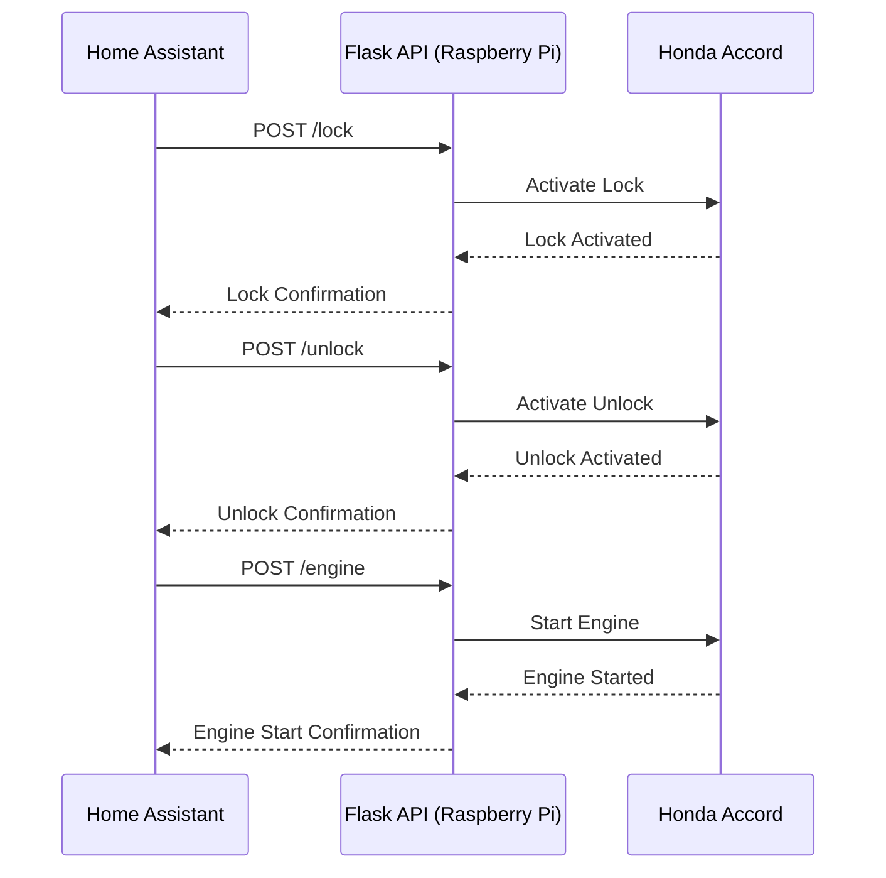

# Honda Accord Remote Control API

This project provides a RESTful API to interact with a Honda Accord's basic functionalities, like lock, unlock, and engine start, using a Raspberry Pi and GPIO pins.

## Features

- RESTful API endpoints for Lock, Unlock, and Engine Start.
- Rate limiting for endpoint access to prevent unintentional rapid triggers.
- Basic Authentication to secure API endpoints.
- Integration examples for Home Assistant.

### Hardware Components:

- **Raspberry Pi:** Serves as the central control for the remote starter functionalities.

- **Start-X Remote Start Kit (Honda Accord 2008-2012):** The dedicated starter kit for the car.

- **Compustar RF-1WR3-AP 1-Way Rf Kit Remote Transmitter:** Interfaces between the Raspberry Pi and the Start-X starter kit.

- **SRD-05VDC-SL-C Relay (on a breakout board):** Used to simulate the button press on the Compustar remote.

- **Wiring:** Soldered onto the right-most pads of the Compustar remote button, these wires are controlled by the Raspberry Pi's GPIO to emulate a button press.

### Functionality:

The Raspberry Pi, via its GPIO, controls the relay to momentarily connect the soldered wires on the Compustar remote, simulating a button press and thereby activating the Start-X Remote Starter in the Honda Accord.

--- 

This format provides a quick reference for the components and a brief description of their interaction.
## Installation & Setup

1. **Clone the Repository**:
   ```bash
   git clone https://github.com/k5njm/remote-start-api.git
   cd remote-start-api
   ```

2. **Set up a Virtual Environment** (recommended):
   ```bash
   python3 -m venv venv
   source venv/bin/activate
   ```

3. **Install the Dependencies**:
   ```bash
   pip install -r requirements.txt
   ```

4. **Environment Variables**:
   Before running the server, make sure to set the required environment variables:
   - `GPIO_PIN`: The GPIO pin number to be used.
   - `API_USERNAME`: Basic Auth username.
   - `API_PASSWORD`: Basic Auth password.

   Example:
   ```bash
   export GPIO_PIN=18
   export USERNAME=myuser
   export PASSWORD=mypassword
   ```
5. **Permissions for GPIO pins**
 On Raspberry Pi systems (Raspbian/Debian based), GPIO pins can be accessed by users in the gpio group. By default, the pi user is added to this group, so if you are using the pi user to run your Flask application, it should be able to access the GPIO pins. If you're using a different user, you need to add that user to the gpio group.
 ```
sudo usermod -a -G gpio your_username
```

## Running the Server

1. Activate your virtual environment (if you're using one):
   ```bash
   source venv/bin/activate
   ```

2. Run the server:
   ```bash
   python app.py
   ```

The server will start, and by default, it will be accessible at `http://127.0.0.1:5000/`.

## Run on system startup

To ensure that the `remote-start-server.py` script runs on system startup and keeps running even if it encounters errors or crashes, you can use a combination of a startup script and a process supervisor like `systemd`. Here's how you can do it on a Raspberry Pi, which typically runs a Raspbian OS (a variant of Debian):

### Step 1: Create a systemd Service

1. Create a systemd service file:

```bash
sudo vim /etc/systemd/system/remote-start-server.service
```

2. Add the following content to the file:

```
[Unit]
Description=Remote Start Server
After=network.target

[Service]
ExecStart=/home/pi/repos/remote-start-api/venv/bin/python3 /home/pi/repos/remote-start-api/remote-start-server.py
WorkingDirectory=/home/pi/repos/remote-start-api
Restart=always
User=pi
Group=pi
Environment=PATH=/usr/bin:/usr/local/bin
Environment=PYTHONPATH=/home/pi/repos/remote-start-api
Environment=API_USERNAME=admin
Environment=API_PASSWORD=password

[Install]
WantedBy=multi-user.target
```

**Note:** 
- Replace API_USERNAME and API_PASSWORD with the desired credentials
- Replace paths to match the locations on your filesystem.

### Step 2: Enable and Start the Service

1. Reload the systemd manager configuration:

```bash
sudo systemctl daemon-reload
```

2. Enable your service so that it starts on boot:

```bash
sudo systemctl enable remote-start-server.service
```

3. Start your service:

```bash
sudo systemctl start remote-start-server.service
```

### Step 3: Monitor and Manage the Service

- To check the status of your service:

```bash
sudo systemctl status remote-start-server.service
```

- If you ever need to stop or restart your service:

```bash
sudo systemctl stop remote-start-server.service
sudo systemctl restart remote-start-server.service
```

The `Restart=always` directive in the service file ensures that if your script crashes or stops for some reason, systemd will attempt to restart it automatically.

This approach makes sure that your script starts up with the system and remains running. If you make updates to the script, you might need to restart the service to apply those changes.

---

## API Endpoints

- **Lock**: `POST /lock`
- **Unlock**: `POST /unlock`
- **Engine Start**: `POST /engine`


### Test with curl:

```sh
curl -X POST -u admin:password http://localhost:5000/lock
{"status":"Lock activated!"}
```

```sh
curl -X POST -u admin:password http://localhost:5000/unlock
{"status":"Unlock activated!"}
```

```sh
curl -X POST -u admin:password http://localhost:5000/engine
{"status":"Engine activated!"}
```

## Home Assistant Integration

### Rest Command
https://www.home-assistant.io/integrations/rest_command/
```yaml
rest_command:
  honda_accord_lock_command:
    url: 'http://localhost:5000/lock'
    method: 'post'
    content_type: 'application/json'
    username: !secret rest_command_username
    password: !secret rest_command_password
  honda_accord_unlock_command:
    url: 'http://localhost:5000/unlock'
    method: 'post'
    content_type: 'application/json'
    username: !secret rest_command_username
    password: !secret rest_command_password
  honda_accord_engine_command:
    url: 'http://localhost:5000/engine'
    method: 'post'
    content_type: 'application/json'
    username: !secret rest_command_username
    password: !secret rest_command_password
```
---

### Scripts
https://www.home-assistant.io/integrations/script/
```yaml
script:
  honda_accord_activate_lock:
    sequence:
      - service: rest_command.honda_accord_lock_command
    alias: "Honda Accord Activate Lock"
  honda_accord_activate_unlock:
    sequence:
      - service: rest_command.honda_accord_unlock_command
    alias: "Honda Accord Activate Unlock"
  honda_accord_activate_engine:
    sequence:
      - service: rest_command.honda_accord_engine_command
    alias: "Honda Accord Activate Engine"
```

I'm using Home Assistant's !secret syntax to pull the username and password from the secrets.yaml file. This way, you don't have your authentication details in plain sight. Make sure you add the correct rest_command_username and rest_command_password in the secrets.yaml file.
`secrets.yaml`
```yaml
rest_command_username: your_username
rest_command_password: your_password
```

## Contributing

If you'd like to contribute to this project, please fork the repository, make your changes, and submit a pull request.

## License

This project is licensed under the MIT License. See the `LICENSE` file for details.

---
