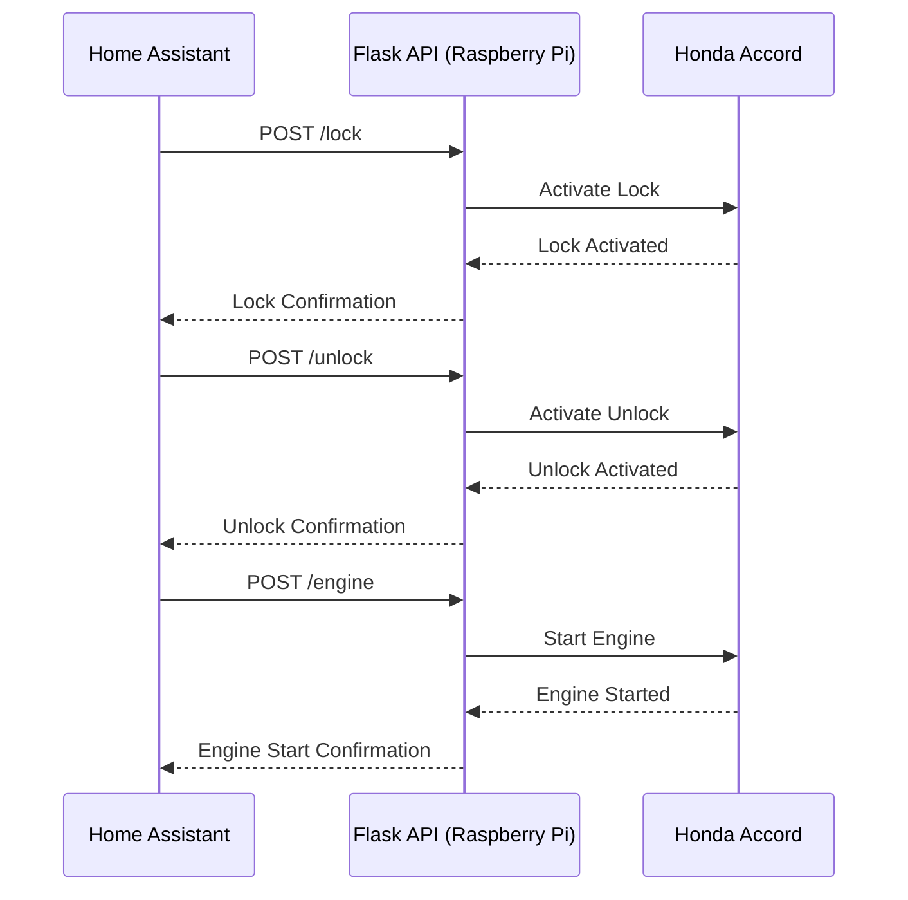

# Honda Accord Remote Control API

This project provides a RESTful API to interact with a Honda Accord's basic functionalities, like lock, unlock, and engine start, using a Raspberry Pi and GPIO pins.

## Features

- RESTful API endpoints for Lock, Unlock, and Engine Start.
- Rate limiting for endpoint access to prevent unintentional rapid triggers.
- Basic Authentication to secure API endpoints.
- Integration examples for Home Assistant.

### Hardware Components:

- **Raspberry Pi:** Serves as the central control for the remote starter functionalities.

- **Start-X Remote Start Kit (Honda Accord 2008-2012):** The dedicated starter kit for the car.

- **Compustar RF-1WR3-AP 1-Way Rf Kit Remote Transmitter:** Interfaces between the Raspberry Pi and the Start-X starter kit.

- **SRD-05VDC-SL-C Relay (on a breakout board):** Used to simulate the button press on the Compustar remote.

- **Wiring:** Soldered onto the right-most pads of the Compustar remote button, these wires are controlled by the Raspberry Pi's GPIO to emulate a button press.

### Functionality:

The Raspberry Pi, via its GPIO, controls the relay to momentarily connect the soldered wires on the Compustar remote, simulating a button press and thereby activating the Start-X Remote Starter in the Honda Accord.

--- 

This format provides a quick reference for the components and a brief description of their interaction.
## Installation & Setup

1. **Clone the Repository**:
   ```bash
   git clone https://github.com/k5njm/remote-start-api.git
   cd remote-start-api
   ```

2. **Set up a Virtual Environment** (recommended):
   ```bash
   python3 -m venv venv
   source venv/bin/activate
   ```

3. **Install the Dependencies**:
   ```bash
   pip install -r requirements.txt
   ```

4. **Environment Variables**:
   Before running the server, make sure to set the required environment variables:
   - `GPIO_PIN`: The GPIO pin number to be used.
   - `USERNAME`: Basic Auth username.
   - `PASSWORD`: Basic Auth password.

   Example:
   ```bash
   export GPIO_PIN=18
   export USERNAME=myuser
   export PASSWORD=mypassword
   ```

## Running the Server

1. Activate your virtual environment (if you're using one):
   ```bash
   source venv/bin/activate
   ```

2. Run the server:
   ```bash
   python app.py
   ```

The server will start, and by default, it will be accessible at `http://127.0.0.1:5000/`.

## API Endpoints

- **Lock**: `POST /lock`
- **Unlock**: `POST /unlock`
- **Engine Start**: `POST /engine`



## Home Assistant Integration

### Rest Command
https://www.home-assistant.io/integrations/rest_command/
```yaml
rest_command:
  honda_accord_lock_command:
    url: 'http://localhost:5000/lock'
    method: 'post'
    content_type: 'application/json'
    username: !secret rest_command_username
    password: !secret rest_command_password
  honda_accord_unlock_command:
    url: 'http://localhost:5000/unlock'
    method: 'post'
    content_type: 'application/json'
    username: !secret rest_command_username
    password: !secret rest_command_password
  honda_accord_engine_command:
    url: 'http://localhost:5000/engine'
    method: 'post'
    content_type: 'application/json'
    username: !secret rest_command_username
    password: !secret rest_command_password
```
---

### Scripts
https://www.home-assistant.io/integrations/script/
```yaml
script:
  honda_accord_activate_lock:
    sequence:
      - service: rest_command.honda_accord_lock_command
    alias: "Honda Accord Activate Lock"
  honda_accord_activate_unlock:
    sequence:
      - service: rest_command.honda_accord_unlock_command
    alias: "Honda Accord Activate Unlock"
  honda_accord_activate_engine:
    sequence:
      - service: rest_command.honda_accord_engine_command
    alias: "Honda Accord Activate Engine"
```

I'm using Home Assistant's !secret syntax to pull the username and password from the secrets.yaml file. This way, you don't have your authentication details in plain sight. Make sure you add the correct rest_command_username and rest_command_password in the secrets.yaml file.
`secrets.yaml`
```yaml
rest_command_username: your_username
rest_command_password: your_password
```

## Contributing

If you'd like to contribute to this project, please fork the repository, make your changes, and submit a pull request.

## License

This project is licensed under the MIT License. See the `LICENSE` file for details.

---
